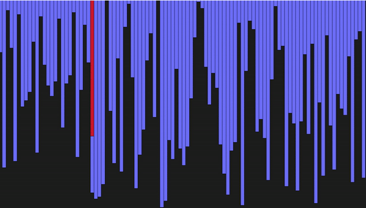

What we will learn is-how to analyse sorting algorithm indepth.

# Sorting Algorithms
Sorting Algorithms - Visual Representation
This project showcases visual demonstrations of different sorting algorithms using Python and Tkinter.

Algorithms Covered:
Selection Sort
Bubble Sort
Insertion Sort
Merge Sort
Quick Sort

## Selection Sort

<b>Selection</b> sort manipulates elements in the array <i>"in-place"</i>. Due to the time complexity, efficiencies arise when working on large lists.
  
It has <i>similarities</i> to the insertion sort algorithm presented below.
Therefore, if comparing both, selection sort generally performs suboptimally versus insertion sort.

    Worst complexity: n^2
    Average complexity: n^2
    Best complexity: n^2
    Space complexity: 1
    Method: Selection
    Stable: No
    Class: Comparison sort

## Explanation  of  Bubble Sort

Bubble sort compares adjacent elements and swaps them if they are in the wrong order. The pass of the list repeats to obtain the final ordered values.  
Items are seen to <i>bubble</i> to the top of the array, thus giving the algorithm its name. Alternatively, they may <i>sink</i>, which is the other name for this algorithm, <i>sinking</i> sort.

    Worst complexity: n^2
    Average complexity: n^2
    Best complexity: n
    Space complexity: 1
    Method: Exchanging
    Stable: Yes
    Class: Comparison sort

## Explanation  of Insertion Sort

<b>Insertion</b> sort is a simple sorting algorithm that builds the final sorted array one item at a time. It is much less efficient on large lists than more advanced algorithms such as quicksort, heapsort, or merge sort. Wikipedia

    Worst complexity: n^2
    Average complexity: n^2
    Best complexity: n
    Space complexity: 1
    Method: Insertion
    Stable: Yes
    Class: Comparison sort

 

## Explanation  of Merge Sort

<b>Merge</b> sort is an efficient, general-purpose, comparison-based sorting algorithm. Most implementations produce a stable sort, meaning that the order of equal elements is the same in the input and output.
Merge sort is a divide and conquer algorithm.

    Worst complexity: n*log(n)
    Average complexity: n*log(n)
    Best complexity: n*log(n)
    Space complexity: n
    Method: Merging
    Stable: Yes

## Explanation  of Quick Sort

<b>Quicksort</b> is a highly efficient sorting algorithm using the divide and conquer approach. It selects a pivot, partitions the array into elements less than and greater than the pivot, and recursively sorts the subarrays.

    Worst complexity: n^2
    Average complexity: n*log(n)
    Best complexity: n*log(n)
    Method: Partitioning
    Stable: No
    Class: Comparison sort
    

QuickSort is usually faster and more space-efficient, but MergeSort guarantees stability and better worst-case performance.
